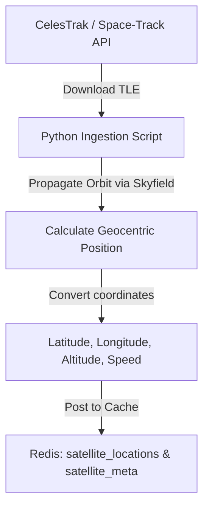

# Automatic Satellite Data Ingestion Guide

This document details how the project can automatically fetch, parse, and propagate real-world satellite orbital coordinates (latitude, longitude, altitude, and velocity) using open public data and Python libraries.

---

## 1. Key Libraries & Sources

### A. Python Libraries
1. **`skyfield`**: A high-precision, modern astronomy and physics engine for Python. It is the industry standard for propagating Two-Line Element (TLE) datasets using the SGP4 (Simplified General Perturbations) model.
2. **`spacetrack`**: A Python wrapper for the official [Space-Track.org](https://www.space-track.org) API, which is run by the US Space Command. It requires free account registration to query the complete satellite catalog.
3. **`requests`**: Standard Python HTTP library to download public orbital catalogs.

### B. Public Data Providers
* **CelesTrak**: A free, public resource managed by Dr. T.S. Kelso that provides categorized, real-time TLE listings (e.g., SpaceX Starlink, active satellites, space station, weather constellations) without requiring API registration.
  * *Base URL*: `https://celestrak.org/NORAD/elements/`

---

## 2. Automated Coordinate Ingestion Pipeline

To get real-time coordinate data, the system needs to:
1. **Download TLEs**: Fetch the latest 3-line or 2-line orbital elements for the desired constellation.
2. **Load Ephemeris Data**: Load celestial ephemeris files (like `de421.bsp`) to calculate precise positions relative to Earth's center of mass.
3. **Propagate**: Compute the exact position (latitude, longitude, altitude, speed) of the satellite at the current time (`datetime.utcnow()`).
4. **Push**: Stream the calculated coordinates directly into the Redis geospatial cache.



---

## 3. Reference Implementation

Below is a complete, executable Python example demonstrating how to automatically fetch and propagate active satellite orbits:

```python
import time
from datetime import datetime, timezone
import requests
from skyfield.api import load, wgs84

# 1. Fetch active satellites TLE from CelesTrak
# In this example, we fetch the active satellite list
CELESTRAK_URL = "https://celestrak.org/NORAD/elements/gp.php?GROUP=active&FORMAT=tle"

print("Downloading latest orbital elements from CelesTrak...")
response = requests.get(CELESTRAK_URL)
response.raise_for_status()

# Save the TLE file locally for Skyfield to load
tle_filename = "active_satellites.tle"
with open(tle_filename, "w") as f:
    f.write(response.text)

# 2. Load the satellites using Skyfield
satellites = load.tle_file(tle_filename)
print(f"Loaded {len(satellites)} satellites successfully.")

# We will also load Earth ephemeris data for time conversions
ts = load.timescale()

# 3. Propagate orbits to the current instant
def propagate_satellites():
    # Get current time in UTC
    now = datetime.now(timezone.utc)
    t = ts.from_datetime(now)
    
    # We can inspect a subset (e.g., the first 5 satellites)
    for satellite in satellites[:5]:
        # Propagate the satellite to time t
        geocentric = satellite.at(t)
        
        # Calculate latitude, longitude, and elevation relative to WGS84 ellipsoid
        subpoint = wgs84.subpoint(geocentric)
        
        latitude = subpoint.latitude.degrees
        longitude = subpoint.longitude.degrees
        altitude_km = subpoint.elevation.km
        
        # Calculate velocity (vector relative to Earth center)
        # Position is geocentric.position.km, velocity is geocentric.velocity.km_per_s
        velocity_vector = geocentric.velocity.km_per_s
        speed_kms = (velocity_vector[0]**2 + velocity_vector[1]**2 + velocity_vector[2]**2) ** 0.5
        
        print(f"Satellite: {satellite.name.strip()}")
        print(f"  NORAD ID : {satellite.model.satnum}")
        print(f"  Position : Lat {latitude:0.4f}°, Lon {longitude:0.4f}°")
        print(f"  Altitude : {altitude_km:0.2f} km")
        print(f"  Speed    : {speed_kms:0.4f} km/s")
        print("-" * 40)

if __name__ == "__main__":
    propagate_satellites()
```

---

## 4. Production Pipeline Recommendations & Quality Controls

### 4.1 TLE Refreshing & Decay
* **Schedules**: Satellite orbits decay over time due to atmospheric drag, solar radiation pressure, and gravitational anomalies. TLE datasets are updated by US Space Command 2 to 4 times a day.
* **Implementation**: A daily Celery Beat task downloads fresh TLE streams from CelesTrak or Space-Track.org and writes them to a local storage bucket or database table.

### 4.2 Real-time Propagation Loop (Background Worker)
* **Design**: Running HTTP fetch calls or disk reads for coordinate calculations is highly inefficient. Instead, an independent daemon process or asyncio worker is run.
* **Initialization**: At startup, the background worker loads active satellites and their associated TLE definitions from the PostgreSQL registry into an in-memory dictionary.
* **Execution (5-Second Tick)**: Every 5 seconds, the worker:
  1. Computes the current time in the timescale system format (`ts.now()`).
  2. Loops over each cached satellite and propagates its position using the SGP4 math engine.
  3. Writes the calculated coordinates (Lat, Lon, Altitude, Speed) to Redis using `GEOADD` and `HSET` within a Redis pipeline block to batch TCP operations.
* **PyPy Execution**: Because orbital coordinate propagation (specifically the trigonometric and vector math required by SGP4/Skyfield) is heavily CPU-bound, running this worker daemon under the **[PyPy JIT compiler](https://pypy.org/features.html)** is highly recommended. PyPy compiles the hot propagation loops into native machine instructions, enabling the worker to propagate thousands of satellites in a fraction of a second.


### 4.3 TLE Age Verification & Degradation Triggers
To prevent stale orbital predictions, the background worker performs validation checks on TLE age:
1. **Age Calculation**: The TLE age is calculated as the difference between the current system UTC time and the epoch time specified within the TLE definition record.
2. **Degradation Rules**:
   * **Stale warning (> 7 days)**: If a TLE is older than 7 days, a warning flag is logged, and the satellite record in PostgreSQL is marked as warning.
   * **Degraded trigger (> 14 days)**: If a TLE is older than 14 days, the background worker automatically updates the satellite status in PostgreSQL to `DEGRADED` or `INACTIVE` and alerts system operators. The satellite is excluded from the active routing mesh to prevent traffic loss.
3. **Recovery**: Once a new TLE containing a fresh epoch is successfully downloaded and loaded, the satellite's status is restored to `ACTIVE` automatically.

