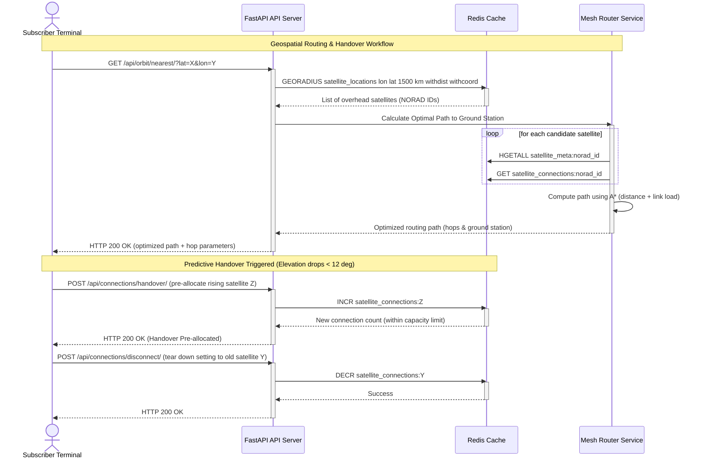

# Component Detail: Real-Time Orbital Tracking & Connection Manager

This document describes the design, Redis data structures, and algorithms used to support real-time geospatial location queries and subscriber link states.

---

## 1. Database Role (Redis)

Operational orbit routing decisions are time-critical:
* Satellites travel at approximately **7.8 km/s** in Low Earth Orbit (LEO), meaning their lines of sight change rapidly.
* Routing algorithms require finding active satellites in sub-millisecond ranges to prevent internet packet drops.

We utilize **Redis** because:
* **Sub-Millisecond Read/Write**: In-memory speeds support real-time geospatial updates and queries.
* **Native Geospatial Commands**: Built-in support for Geohash indexing and radial lookups.
* **Atomic Operations**: Thread-safe operations prevent connection counter race conditions.

---

## 2. Redis Data Structures & Key Designs

We deploy three distinct Redis structures, managed in [connections/orbit_service.py](file:///Users/amolc/2026/spaceinternet/connections/orbit_service.py):

```
       [Redis Keyspace]
       ├── "satellite_locations" ──────────────────► Geospatial ZSET (GEOADD)
       │                                              - Member: "55001" (Geohash 52-bit)
       │                                              - Member: "55002" (Geohash 52-bit)
       │
       ├── "satellite_meta:55001" ─────────────────► HASH (HSET)
       │                                              - speed_kms: 7.6
       │                                              - altitude_km: 550
       │                                              - updated_at: "2026-06-09T01:00:00"
       │
       └── "satellite_connections:55001" ──────────► STRING Counter (INCR/DECR)
                                                      - Value: 42
```

### 2.1 Geospatial Index (`ZSET`)
* **Key**: `satellite_locations`
* **Command**: `GEOADD satellite_locations longitude latitude norad_id`
* **Internal Behavior**: Redis converts the (longitude, latitude) coordinates into a 52-bit **Geohash** integer. This integer is inserted into a Sorted Set (ZSET) where the score is the geohash value. This enables range searches along a single-dimensional index.

### 2.2 Satellite Metadata Hash
* **Key**: `satellite_meta:{norad_id}`
* **Fields**: `latitude`, `longitude`, `altitude_km`, `speed_kms`, `updated_at`
* **Why**: The geospatial index only holds coordinates. Supplementary values (speed, altitude, timestamp) are stored in this metadata hash for quick lookups.

### 2.3 Subscriber Connections Counter
* **Key**: `satellite_connections:{norad_id}`
* **Type**: String representing an integer.
* **Why**: Managed using atomic commands `INCR` and `DECR` to ensure thread safety when multiple clients connect/disconnect simultaneously.

---

## 3. Core Algorithms, Routing & Handovers

### 3.1 Oblate Spheroid Line-of-Sight & Visibility Math
Subscriber terminals and ground stations calculate satellite visibility using a WGS84 oblate spheroid model of the Earth (rather than a simple sphere) to accurately determine elevation angles:
1. **Coordinate Conversion**: Convert the subscriber's geodetic coordinates (lat, lon, height) and the satellite's state vector (altitude, coordinates) to ECEF (Earth-Centered, Earth-Fixed) Cartesian coordinates.
2. **Elevation Angle Calculation**: Calculate the local look-angle elevation vector. A satellite is only considered visible if its elevation angle exceeds the ground terminal's local horizon mask constraints (minimum of **10° elevation**). This filter accounts for atmospheric attenuation and physical obstructions.

### 3.2 Load-Balanced Multi-Hop ISL Routing
Instead of routing directly to the closest satellite, the system models the constellation as a dynamic mesh network. The routing endpoint calculates paths across multiple inter-satellite links (ISLs) to find the optimal path to a landing ground station:
1. **Dynamic Mesh Construction**: Build an in-memory graph where vertices are satellites/ground stations and edges are active intra-plane and inter-plane inter-satellite links (ISLs).
2. **Edge Cost Calculation (Dijkstra / A\*)**: When routing packets, the algorithm uses Dijkstra or A* to compute the shortest path. Rather than static distance, edge weights are dynamic costs incorporating:
   * **Proximity/Latency**: Physical length of the link (propagation delay).
   * **Load Factor**: The ratio of current connections to capacity limit on the target satellite (using Redis `satellite_connections:{norad_id}`).
   * **Bandwidth Capacity**: Avoid selecting satellites with degraded state or fully saturated link capacity.
3. **Graceful Fallback**: If a path calculation fails or a routing link goes offline, the routing engine degrades gracefully, seeking alternative paths or falling back to single-hop landing ground stations.

### 3.3 Thread-Safe Link Allocation & Session Management
To register subscriber connections, the system executes atomic Redis increments:
```python
def increment_active_connections(norad_id, capacity_limit):
    r = get_redis_client()
    current = r.get(f"satellite_connections:{norad_id}")
    if current and int(current) >= capacity_limit:
        raise CapacityExceededError(f"Satellite {norad_id} is at peak capacity.")
    # Atomic increment
    return r.incr(f"satellite_connections:{norad_id}")
```
Using atomic `INCR` and `DECR` guarantees thread safety and prevents race conditions under high subscriber link traffic.

### 3.4 Predictive Handover Logic
Because satellites move relative to the ground terminal at ~7.8 km/s, connections drop as they sink below the 10° elevation threshold. 
1. **Ascending/Descending Tracking**: The routing service tracks the elevation rate-of-change for overhead satellites.
2. **Pre-Allocation**: When the active satellite's elevation drops below **12°**, the client queries the next rising satellite. The system pre-allocates connection resources on the rising satellite **before** the active link falls below the **10°** horizon, ensuring zero-packet-loss handover.

---

## 4. Production Redis Configuration & Memory Bounds

To ensure high performance and prevent data loss, the Redis instance is configured as follows:

### 4.1 Memory Limits and Eviction Policy
* **Container Allocation**: Sized to support up to 5,000 active satellites, reserving **2 GB of RAM** to handle location cache, hashes, connection keys, and operational variables under maximum load.
* **Maxmemory Configuration**:
  ```text
  maxmemory 2gb
  maxmemory-policy volatile-lru
  ```
* **Why `volatile-lru`**: Keys with explicit TTLs (like hot coordinates that expire in 60 seconds) are evicted if Redis approaches its memory limit. Permanent configurations and active connection counts (which lack a TTL) are protected from sudden eviction, preventing routing corruption.

### 4.2 Durability & Persistence Configuration
To ensure state durability across restarts:
1. **Append-Only File (AOF)**: Enabled with `appendfsync everysec` to ensure a maximum of 1 second of transactional write loss.
2. **RDB Snapshots**: Standard background snapshots configured (e.g. `save 900 1`) as a fallback recovery path.

---

## 5. Sequence Diagram

This sequence diagram illustrates real-time coordinate caching, load-balanced multi-hop routing, and predictive connection handovers served by FastAPI:




