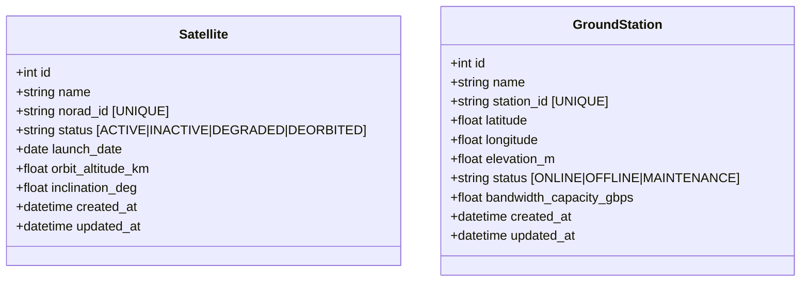
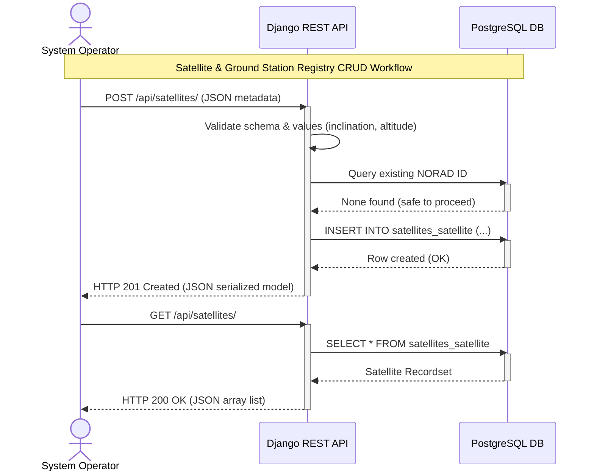

# Component Detail: Satellite & Ground Station Relational Registry

This document describes the design, implementation, and database architecture of the relational registry system built for the Space Internet Service Provider.

---

## 1. Database Role (PostgreSQL)

The registry system handles data that changes slowly but requires strict consistency, relational integrity, and standard transactional ACID guarantees. This data acts as the **System of Record** for all satellite metadata, ground station configurations, and billing/subscription states.

---

## 2. Schema and Model Definitions

Our models are defined in [satellites/models.py](file:///Users/amolc/2026/spaceinternet/satellites/models.py):

### 2.1 Satellite Table
* `norad_id` (NORAD Catalog Number): Primary lookup key used by external telemetry logs and orbital state caches. It is indexed and constrained to be unique.
* `inclination_deg` and `orbit_altitude_km`: Essential orbital parameters used by propagation mathematical engines.

### 2.2 GroundStation Table
* `latitude` & `longitude`: Represent geographical coordinates. Used in Redis `GEORADIUS` queries to find which satellites are overhead.
* `bandwidth_capacity_gbps`: Defines maximum throughput limit.

---

## 3. REST API ViewSets & Routing

We use Django REST Framework (DRF) to automatically build full CRUD REST endpoints:
* **Serializer**: Configured in [satellites/serializers.py](file:///Users/amolc/2026/spaceinternet/satellites/serializers.py).
* **ViewSets**: Declared in [satellites/views.py](file:///Users/amolc/2026/spaceinternet/satellites/views.py).
* **Endpoints**:
  * `GET /api/satellites/` - Lists all registered satellites.
  * `POST /api/satellites/` - Registers a new satellite.
  * `GET /api/satellites/{id}/` - Retrieves metadata for a single satellite.
  * `PUT/PATCH /api/satellites/{id}/` - Updates parameters.
  * `DELETE /api/satellites/{id}/` - Retires a satellite from the registry.
  * Similar CRUD endpoints are exposed under `/api/ground-stations/` for ground station management.

---

## 4. Integrity and Performance Indexing

To guarantee system efficiency and avoid query performance degradation:
1. **Unique Indices**: Django automatically creates unique indices on `norad_id` and `station_id` to guarantee no duplicate registries.
2. **Search Indexing**: Standard query filters on `status` columns are supported. As the registry grows to thousands of elements, we should add a database index on `status` fields to optimize filtering speeds.
3. **Validation Constraints**: 
   * Geolocation fields `latitude` and `longitude` are bounded in input serializers (e.g. latitude between -90 and 90, longitude between -180 and 185).

---

## 5. Sequence Diagram

This sequence diagram illustrates the registration and retrieval workflow for the relational registries:

