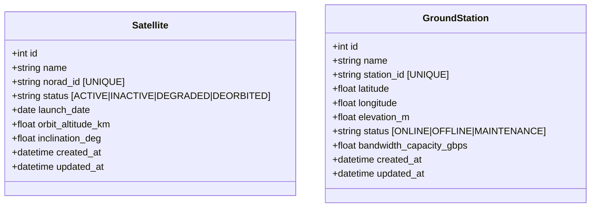
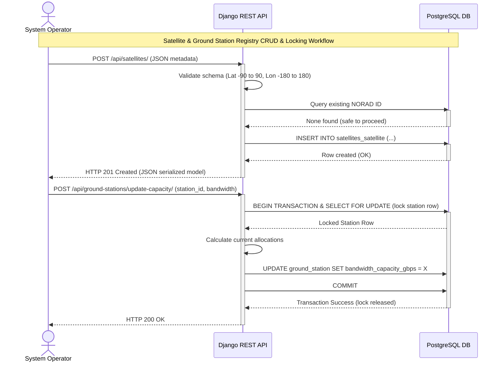

# Component Detail: Satellite & Ground Station Relational Registry

This document describes the design, implementation, and database architecture of the relational registry system built for the Space Internet Service Provider.

---

## 1. Database Role (PostgreSQL)

The registry system handles data that changes slowly but requires strict consistency, relational integrity, and standard transactional ACID guarantees. This data acts as the **System of Record** for all satellite metadata, ground station configurations, and billing/subscription states.

---

## 2. Schema and Model Definitions

Our models are defined in [satellites/models.py](file:///Users/amolc/2026/spaceinternet/satellites/models.py):



### 2.1 Satellite Table
* `norad_id` (NORAD Catalog Number): Primary lookup key used by external telemetry logs and orbital state caches. It is indexed and constrained to be unique.
* `inclination_deg` and `orbit_altitude_km`: Essential orbital parameters used by propagation mathematical engines.

### 2.2 GroundStation Table
* `latitude` & `longitude`: Represent geographical coordinates. Used in Redis `GEORADIUS` queries to find which satellites are overhead.
* `bandwidth_capacity_gbps`: Defines maximum throughput limit.

---

## 3. REST API ViewSets & Routing

We use Django REST Framework (DRF) to automatically build full CRUD REST endpoints:
* **Serializer**: Configured in [satellites/serializers.py](file:///Users/amolc/2026/spaceinternet/satellites/serializers.py).
* **ViewSets**: Declared in [satellites/views.py](file:///Users/amolc/2026/spaceinternet/satellites/views.py).
* **Endpoints**:
  * `GET /api/satellites/` - Lists all registered satellites.
  * `POST /api/satellites/` - Registers a new satellite.
  * `GET /api/satellites/{id}/` - Retrieves metadata for a single satellite.
  * `PUT/PATCH /api/satellites/{id}/` - Updates parameters.
  * `DELETE /api/satellites/{id}/` - Retires a satellite from the registry.
  * Similar CRUD endpoints are exposed under `/api/ground-stations/` for ground station management.

---

## 4. Integrity, Performance Indexing, and Concurrency

To guarantee system efficiency, avoid query performance degradation, and prevent data corruption:

### 4.1 Indexing and Constraints
1. **Unique Indices**: Django automatically creates unique database indices on `norad_id` and `station_id` to ensure no duplicate registry records.
2. **Search Indexing**: Standard query filters on `status` columns are supported. A composite index or individual indexes on `status` columns are declared in `class Meta` to optimize filtering speed as the constellation scale reaches thousands of nodes:
   * `class Meta: indexes = [models.Index(fields=['status'])]`
3. **Validation Constraints**: 
   * Geolocation fields `latitude` and `longitude` are strictly bounded in the database models and input serializers:
     * Latitude: `-90.0` to `90.0` degrees.
     * Longitude: `-180.0` to `180.0` degrees.

### 4.2 Concurrency Controls & Transactional Boundaries
When GroundStation status shifts (e.g. to `OFFLINE`) or when subscriber link capacities are updated, the system handles writes inside a transaction block with lock-retry logic to prevent race conditions or deadlock failures:
1. **Pessimistic Locking**: For ground-station link adjustments, Django uses `select_for_update()` to lock the row during database modification:
   ```python
   from django.db import transaction
   
   with transaction.atomic():
       station = GroundStation.objects.select_for_update().get(station_id=sid)
       # Perform safety checks and adjust allocation bandwidth
       station.bandwidth_capacity_gbps = updated_capacity
       station.save()
   ```
2. **Lock-Retry Middleware**: In high-contention scenarios, database serialization failures are caught by a middleware/utility decorator that retries transactions (up to 3 times with exponential backoff) if a database transaction conflict or deadlock is raised.

---

## 5. Sequence Diagram

This sequence diagram illustrates the registration and transactional update workflow for the relational registries:




