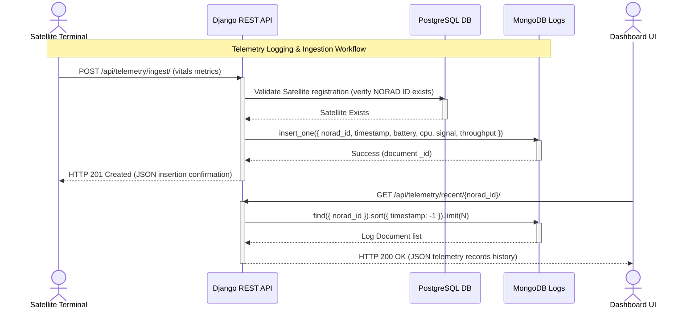

# Component Detail: High-Frequency Satellite Telemetry System

This document specifies the design, data representation, and NoSQL storage pattern for the satellite telemetry logs system.

---

## 1. Database Role (MongoDB)

Satellites stream vitals data at short intervals (e.g. every 3–5 seconds). Standard relational databases can suffer from lock contention, write amplification, and massive table bloating under such heavy write loads. 

We utilize **MongoDB** because:
* **Write-Optimized Performance**: MongoDB handles high-volume document inserts with minimal overhead.
* **Flexible Schema**: Telemetry packets can evolve over time (e.g. adding new payload sensor readings) without requiring schema migrations.
* **Built-in Time-Series Engines**: MongoDB offers optimized time-series compression and automatic document expiration.

---

## 2. Document Data Model

Telemetry packets are stored as flat BSON documents in the `satellite_telemetry` collection:

```json
{
  "_id": ObjectId("6493b84c8a2b534cf5e1b9a2"),
  "norad_id": "55001",
  "timestamp": ISODate("2026-06-09T01:00:00.000Z"),
  "battery_temp_c": 26.4,
  "battery_soc_pct": 92.5,
  "cpu_usage_pct": 34.2,
  "signal_strength_dbm": -68.4,
  "throughput_mbps": 185.0,
  "status_code": "OK"
}
```

---

## 3. Query Indexing Strategy

To keep chart queries and real-time dashboard fetches performing under **sub-10ms** response times, we define a **Compound Index** on the collection:

```javascript
db.satellite_telemetry.createIndex({ norad_id: 1, timestamp: -1 })
```

* **Why**: The primary query pattern is `find({ norad_id: X }).sort({ timestamp: -1 }).limit(N)`. A compound index ensures that MongoDB can retrieve the chronological logs directly from memory without performing an expensive in-memory sort stage (`COLLSCAN`).

---

## 4. Aggregation Pipelines

For operational dashboard metrics and alert monitoring, we perform real-time aggregations inside [telemetry_service.py](file:///Users/amolc/2026/spaceinternet/telemetry/telemetry_service.py):

```javascript
db.satellite_telemetry.aggregate([
  {
    $group: {
      _id: "$norad_id",
      avg_temp: { $avg: "$battery_temp_c" },
      avg_signal: { $avg: "$signal_strength_dbm" },
      avg_throughput: { $avg: "$throughput_mbps" },
      count: { $sum: 1 }
    }
  }
])
```
This query yields summarized operational averages per satellite, which are cached or displayed on admin summary pages.

---

## 5. Scaling & Maintenance Considerations

### 5.1 MongoDB Time-Series Collections (Production Recommendation)
For a large-scale deployment, we recommend declaring the collection as a native **Time-Series Collection**:
```javascript
db.createCollection("satellite_telemetry", {
   timeseries: {
      timeField: "timestamp",
      metaField: "norad_id",
      granularity: "seconds"
   }
})
```
* **Benefits**: 
  * Shrinks disk storage footprints by up to **90%** via internal columnar compression.
  * Speeds up time-window queries dramatically.

### 5.2 Time-To-Live (TTL) Data Expiry
To prevent disk exhaustion, we create a TTL index to automatically purge raw documents older than 30 days:
```javascript
db.satellite_telemetry.createIndex( { "timestamp": 1 }, { expireAfterSeconds: 2592000 } )
```
Purged data remains archived in the PostgreSQL cold repository in aggregated form.

---

## 6. Sequence Diagram

This sequence diagram illustrates the telemetry streaming ingestion and lookup workflow:



