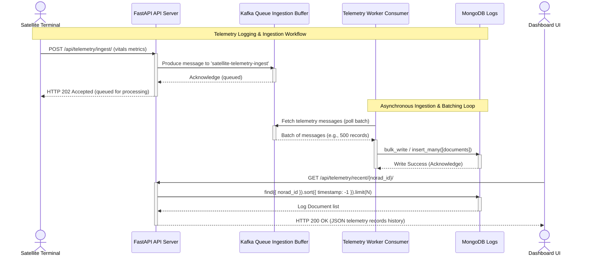

# Component Detail: High-Frequency Satellite Telemetry System

This document specifies the design, data representation, and NoSQL storage pattern for the satellite telemetry logs system, including high-throughput ingestion pipelines.

---

## 1. Database & Ingestion Role

Satellites stream vitals data at short intervals (e.g. every 3–5 seconds). Standard relational databases can suffer from lock contention, write amplification, and massive table bloating under such heavy write loads.

To support the SLA of **10,000 writes/second**, the ingestion pipeline is split into a message broker ingestion layer and a time-series document store:
* **Apache Kafka / RabbitMQ Ingestion Buffer**: Decouples incoming REST API writes from the database. It absorbs write spikes and handles backpressure if MongoDB throughput fluctuates.
* **MongoDB**: A write-optimized document store that handles batch insertions from ingestion consumers and provides low-latency time-series indexes for diagnostics.

---

## 2. Telemetry Ingestion Pipeline & Worker Pattern

```
 [Satellites] ──► [FastAPI API Endpoints]
                       │
                       ▼ (Fast Async Produce)
             [Kafka Ingestion Topic]
                       │
                       ▼ (Consumer Batching: 500 ms / 1000 docs)
          [Asynchronous Telemetry Workers]
                       │
                       ▼ (Bulk Insert: insert_many)
                  [MongoDB DB]
```

1. **Ingestion Endpoint**: The FastAPI API does not write directly to MongoDB. Instead, it serializes the incoming payload and immediately produces a message to the Kafka `satellite-telemetry-ingest` topic. This operation is asynchronous and non-blocking, ensuring sub-5ms API response times.
2. **Asynchronous Consumers**: Lightweight Python/Celery or Go consumer processes subscribe to the Kafka topic. They buffer incoming messages and execute bulk insertions:
   ```python
   # Example consumer loop logic
   def process_telemetry_batch(messages):
       bulk_docs = []
       for msg in messages:
           bulk_docs.append({
               "norad_id": msg.data['norad_id'],
               "timestamp": parse_datetime(msg.data['timestamp']),
               "battery_temp_c": float(msg.data['battery_temp_c']),
               "battery_soc_pct": float(msg.data['battery_soc_pct']),
               "cpu_usage_pct": float(msg.data['cpu_usage_pct']),
               "signal_strength_dbm": float(msg.data['signal_strength_dbm']),
               "throughput_mbps": float(msg.data['throughput_mbps']),
               "status_code": msg.data['status_code']
           })
       
       if bulk_docs:
           db.satellite_telemetry.insert_many(bulk_docs, ordered=False)
   ```
   * **PyPy Execution**: Because telemetry JSON parsing and validation are heavily CPU-bound in Python, execution of the consumer daemon under the **[PyPy JIT compiler](https://pypy.org/features.html)** is recommended to maximize parser performance and keep CPU utility low under maximum load.
3. **Backpressure Strategy**: If MongoDB writes slow down, the Kafka broker acts as a buffer. Consumers decrease their read rate to match MongoDB write limits without rejecting or losing incoming satellite payloads.


---

## 3. Document Data Model

Telemetry packets are stored as flat BSON documents in the `satellite_telemetry` collection:

```json
{
  "_id": ObjectId("6493b84c8a2b534cf5e1b9a2"),
  "norad_id": "55001",
  "timestamp": ISODate("2026-06-09T01:00:00.000Z"),
  "battery_temp_c": 26.4,
  "battery_soc_pct": 92.5,
  "cpu_usage_pct": 34.2,
  "signal_strength_dbm": -68.4,
  "throughput_mbps": 185.0,
  "status_code": "OK"
}
```

---

## 4. Query Indexing Strategy

To keep chart queries and real-time dashboard fetches performing under **sub-10ms** response times, we define a **Compound Index** on the collection:

```javascript
db.satellite_telemetry.createIndex({ norad_id: 1, timestamp: -1 })
```

* **Why**: The primary query pattern is `find({ norad_id: X }).sort({ timestamp: -1 }).limit(N)`. A compound index ensures that MongoDB can retrieve the chronological logs directly from memory without performing an expensive in-memory sort stage (`COLLSCAN`).

---

## 5. Aggregation Pipelines

For operational dashboard metrics and alert monitoring, we perform real-time aggregations inside [telemetry_service.py](file:///Users/amolc/2026/spaceinternet/telemetry/telemetry_service.py):

```javascript
db.satellite_telemetry.aggregate([
  {
    $group: {
      _id: "$norad_id",
      avg_temp: { $avg: "$battery_temp_c" },
      avg_signal: { $avg: "$signal_strength_dbm" },
      avg_throughput: { $avg: "$throughput_mbps" },
      count: { $sum: 1 }
    }
  }
])
```
This query yields summarized operational averages per satellite, which are cached or displayed on admin summary pages.

---

## 6. Scaling & Maintenance Considerations

### 6.1 MongoDB Time-Series Collections (Production Config)
For production deployments, the `satellite_telemetry` collection is declared as a native **Time-Series Collection**:
```javascript
db.createCollection("satellite_telemetry", {
   timeseries: {
      timeField: "timestamp",
      metaField: "norad_id",
      granularity: "seconds"
   }
})
```
* **Benefits**: 
  * Shrinks disk storage footprints by up to **90%** via internal columnar compression.
  * Speeds up time-window queries dramatically.

### 6.2 Time-To-Live (TTL) Data Expiry
To prevent disk exhaustion, we create a TTL index to automatically purge raw documents older than 30 days:
```javascript
db.satellite_telemetry.createIndex( { "timestamp": 1 }, { expireAfterSeconds: 2592000 } )
```
Purged data remains archived in the PostgreSQL cold repository in aggregated form.

### 6.3 Memory Bounds & Cache Configuration
* **WiredTiger Cache Sizing**: MongoDB is configured to allocate **50% of total physical RAM** to the WiredTiger storage engine cache, ensuring index pages and active insertion tables reside completely in memory.

---

## 7. Sequence Diagram

This sequence diagram illustrates the telemetry streaming ingestion pipeline, showing backpressure buffering and worker bulk inserts served by FastAPI:


